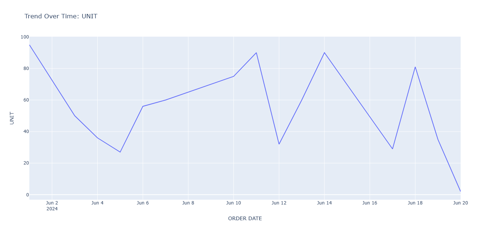
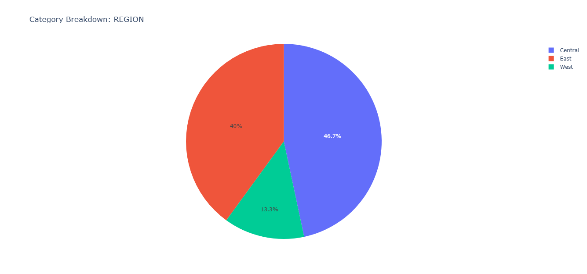

🚀 Excel → AI Dashboard Tool

Turn messy Excel or CSV files into interactive dashboards in seconds.  
No complex setup.  
No Excel expertise required.  
________________________________________
✨ Features

•	 Automatic dashboard generation  
•	 Basic data cleaning  
•	 Fast and simple execution  
•	 Built with Python + Pandas + Plotly  
________________________________________
📸 Example Output
 

________________________________________
▶️ How to Use
1.	Upload your Excel or CSV file 
2.	Run the script 
3.	Open the generated dashboard.html 
________________________________________
🔒 Want AI Insights?

The full version includes:

•	AI-ready JSON export  
•	Premium prompt pack  
•	Faster workflow  
👉 Get it here:
https://imranntenje.gumroad.com/l/sheetsense-ai
________________________________________
🧠 Use Cases

•	Student assignments  
•	Business reports  
•	Data exploration  
•	Quick visual insights  
________________________________________
⚙️ Requirements 
•	Python 3.8+  
•	pandas  
•	plotly  
•	openpyxl  
________________________________________
📬 Built by Imran 

Building simple tools that turn complexity into clarity.
